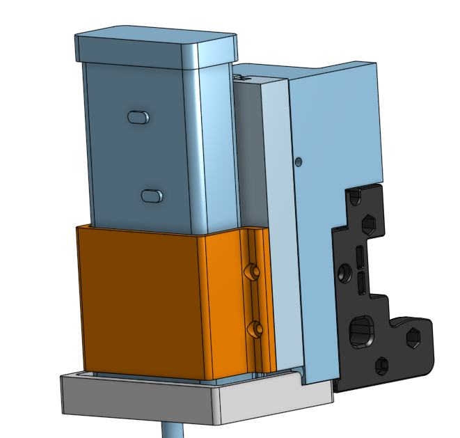

# Voron 2.4 ChipShouter Mount

This is a 3D printable mounting system to put a NewAE ChipShouter on a Voron 2.4 gantry.
It works as a drop-in replacement for the hotend toolhead and retains all of the necessary printer features.
It's also designed to protect the ChipShouter in the event of the gantry crashing into the bed.
All models are designed in [Onshape](https://cad.onshape.com/documents/8dbf5f789ba05639916cf517/w/c36860ceb5f36bfc370563d7/e/81bc64bbedcbce0823c0aeef), so they can be easily modified.

Gcode examples may be Duet-specific. Sorry.



## BOM

This is designed to use the same hardware commonly used for the Voron itself. If you bought plenty of extras, you should already have everything you need.

- 4 x M3x12-16 SHCS (Strap)
- 2 x M3x8-16 SHCS (Support mount)
- 4 x M3x12-20 SHCS (X carriage mount)
- 11 x M3 brass knurled nut insert
- 1 x M3 misc size bolt for Z homing

Any other bolts needed should already be on your printer. Namely, the bolts for the X cable chain mount and the back bolts on the X carriage.

## Printing

The only thing that may need tweaking is the gap size for the sliding channels. Currently a value of 0.35mm is used, which I find to be a little loose but easily printable.
You can reduce this gap for a tighter fit by adjusting the #channel_tolerance variable in Onshape. Any other features (bolt holes, holes for nut inserts) use the same dimensions as Voron parts; if you can print those no problem, this should work fine too. If you want to adjust the tolerance, you can use the Channel Test pieces in Onshape to quickly see how they fit on a printed part before committing.

Material should not matter here. The printer will not be heated whatsoever, and the parts *shouldn't* see any significant force. I used ABS, for what it's worth. You can get away with low infill %. I used 40% on the support piece and 10% for everything else.

## Assembly

0. Make sure the printer is off, cooled down, and unplugged from the wall.
1. Disconnect all toolhead connectors *except for the inductive sensor*. Disconnect the bed heater too. Remove the toolhead.
2. Install 6 M3 nut inserts into the Carriage Adapter piece. There should be 4 on the carriage facing side and 2 on the bottom.
3. Bolt the Carriage Adapter to the X carriage. Make sure any excess belt gets put in the recessed area. There will be 2 bolts on the back of the carriage going into the adapter, and 4 M3x12-20 bolts going from the flat side of the adapter into the carriage.
4. Bolt the X cable chain mount onto the back of the carriage adapter.
4. Install 1 M3 nut insert into the ChipShouter Support piece. This is the misaligned hole and is used to home Z if you use endstop homing.
5. Bolt the ChipShouter Support onto the bottom of the Carriage Adapter with 2 M3x8-16 bolts.
6. Install 4 M3 nut inserts into the back side (with the slots) of the ChipShouter Back Plate.
7. Fasten your ChipShouter to the back plate with the ChipShouter Strap piece and 4 M3x12-16 bolts. The bottom cap should not be flush with the back plate surface. It should be completely protruding.

## Usage

While the slots on the carriage adapter and back plate should take up any Z force in case you crash into the bed, you should still be very careful to ensure this doesn't happen to begin with.
This means you should not attach the ChipShouter components to the printer until you are actually ready to start glitching. Do not home with the ChipShouter on the printer ever.

I recommend reducing the printer's travel speed and acceleration. Here's some gcode to do that on Duet:

```gcode
M201 X500 Y500 Z500
M204 P500 T500
M203 X1000 Y1000 Z1000
```

### Homing

If you use the inductive sensor to home Z, you should not need to do anything different. If you use the Z endstop to home, insert a bolt into the nut on the bottom of the support to act as the nozzle. You can adjust the bolt length to roughly dial in a Z offset, but we're going to fine tune that later anyways. Then, home X, Y, Z, and do QGL as usual.

Once you have the target fixed in place on the bed (TODO: design some clamps for this), install the ChipShouter onto the carriage by sliding the back plate onto the carriage adapter.
With the gantry at a safe height, at least 50mm above the target chip surface, install the tip onto the ChipShouter. Slowly lower the gantry until it is at the absolute lowest point you want it to go; this should be slightly above the surface of the target chip. Now, set this height to the Z 0 level with `G92 Z0`. This will prevent the software from lowering the printer further.

### Target Setup

I'm not sure if the ChipShouter will interfere with the Voron electronics yet. I use a steel sheet on the bed, which should help isolate it, but you should try make sure the target isn't directly above any of the printer electronics. For me this means placing it towards the front of the bed. I just set a silicone electronics mat on the bed and put the target on that. Some clamps to hold it in place might be nice too.

Once you have the target where you want it, make sure the Z 0 point is high enough to move around without getting caught on anything. You might need to move it up 1-2mm and do `G92 Z0` again.
Then, place the tip at the corner of the target chip that is closest to the printer's (0,0). This should be the corner furthest from the X and Y endstops. Then, set these positions as the X and Y 0 with `G92 X0 Y0`.

Now move the tip to the opposite corner of the target chip and set this position as the max for X and Y with `M208 X<current_x> Y<current_y> S0`. This ensures that the tip will never go outside of the chip boundary, and therefore won't run into any tall components like electrolytic caps.

### Glitching

We're ready to start glitching! The CNC part of the process is fairly simple. We start at some determined height above the chip, move around in a grid in our defined XY region, then move lower. Repeat the process until we get the results we want or cannot move any lower. This is easily scriptable with python, see simple_emfi_target.py for an example for one of the included targets.